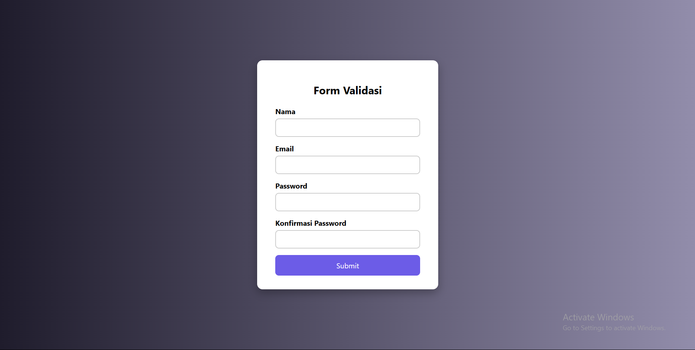

# 🌟 Form Validasi Mewah

Sistem form input yang dirancang dengan tampilan elegan dan dilengkapi dengan **validasi real-time** untuk memastikan data yang diinput oleh pengguna valid dan sesuai format. Dibuat menggunakan kombinasi **HTML5**, **CSS3**, dan **JavaScript murni**.

## 🚀 Fitur Utama

- ✨ Desain modern dan responsif.
- ✅ Validasi input real-time (email, password, nama).
- 🔔 Notifikasi error yang jelas dan user-friendly.
- 📱 Mobile-friendly layout.
- 💡 Placeholder dan animasi input interaktif.

## 🖥️ Tampilan



> Gambar di atas hanya ilustrasi. Anda bisa membuka proyek ini secara langsung melalui live demo.

## 🔗 Live Demo

[🔍 Lihat Live Demo](https://rakamaulana7.github.io/form-validasi-elegan/)

## 🛠️ Teknologi

- **HTML5** – Struktur halaman dan elemen form semantik.
- **CSS3** – Styling elegan dengan layout responsif dan transisi halus.
- **JavaScript** – Logika validasi input secara dinamis.

## 📁 Struktur Proyek
form-validasi/
├── index.html # Struktur utama form
├── style.css # Styling dan animasi
└── script.js # Validasi input dan notifikasi


## 📌 Cara Menjalankan

1. Clone atau download repositori ini:
   ```bash
   git clone https://github.com/RakaMaulana7/form-validasi-elegan.git
   cd form-validasi
